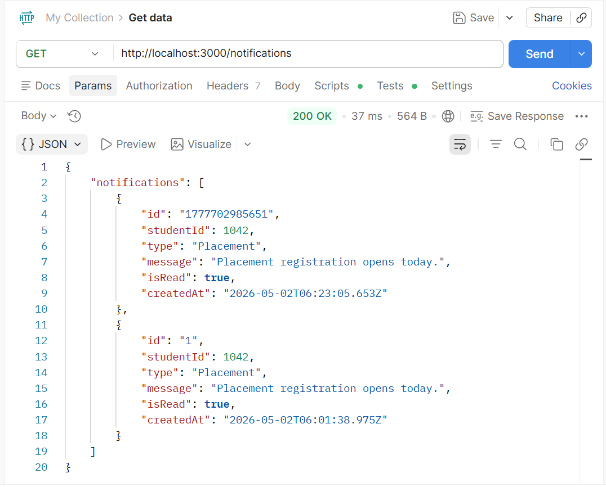
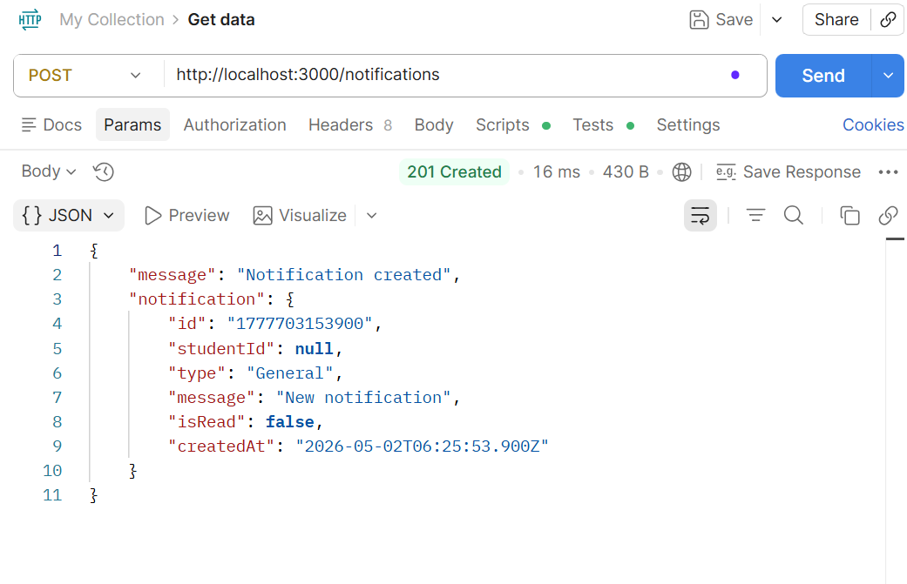
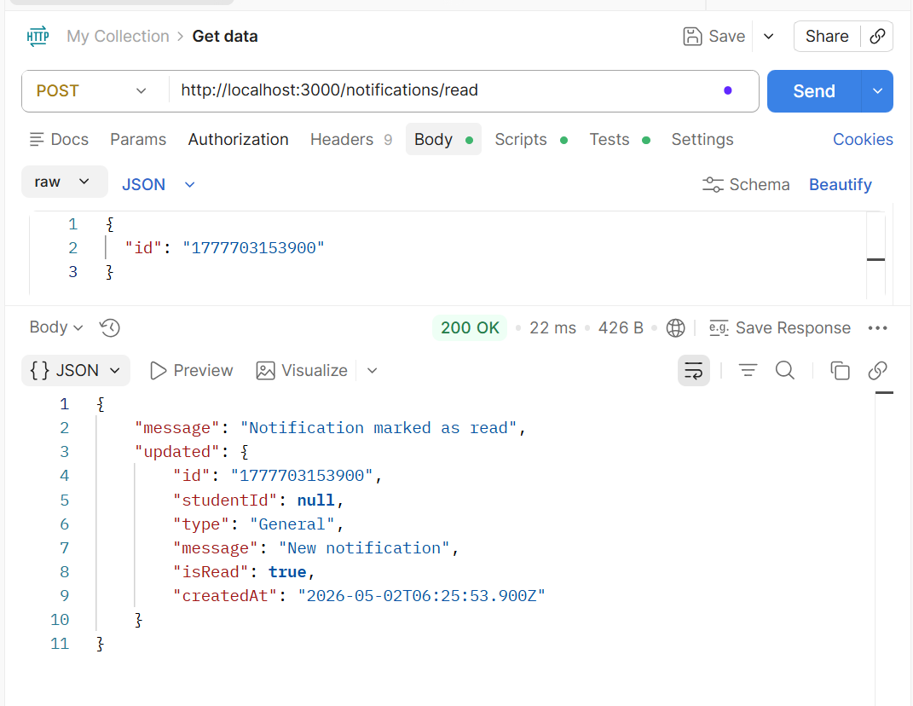
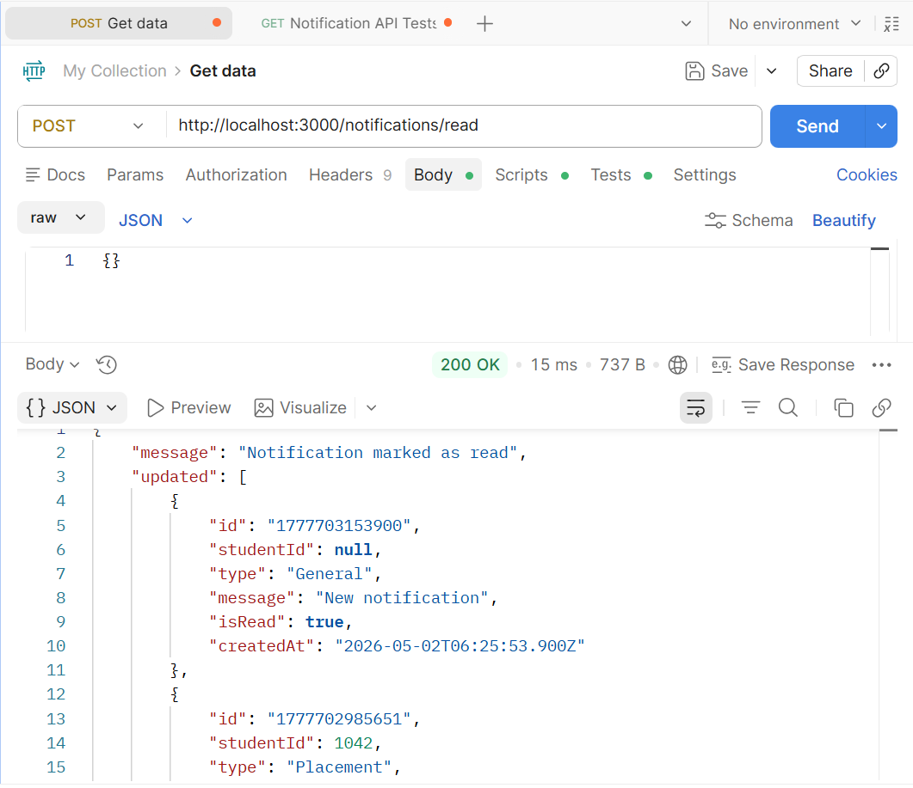
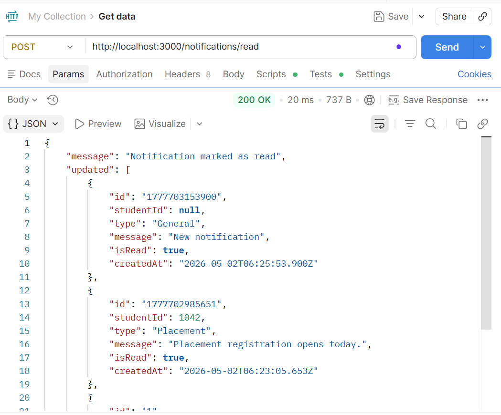
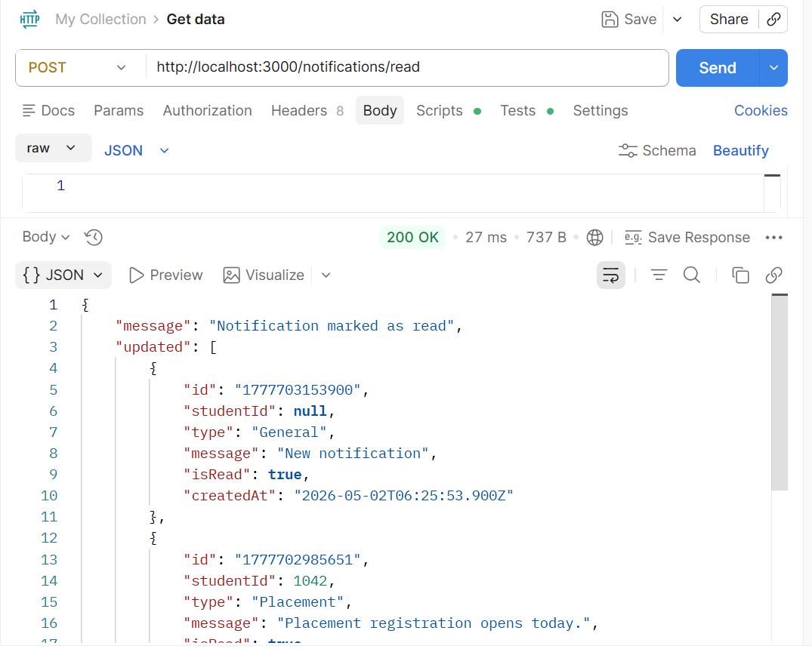

# RA2311026010210

This repository brings together the three parts of the submission: a reusable logging middleware, a vehicle maintenance scheduler, and a notification backend/design write-up. I kept the project small and runnable so that it can be checked quickly without needing private API keys.

The repo is submission-ready even without private keys because it uses `.env.example` for configuration and fallback sample data for local testing.

## What Is Included

1. `logging_middleware` sends logs to the evaluation API when credentials are available.
2. `vehicle_maintenance_scheduler` chooses the best maintenance jobs using dynamic programming.
3. `notification_app_be` provides a clean Express backend skeleton for notification APIs.
4. `notification_system_design.md` explains how the notification system can scale.

## Highlights

- Modular architecture with separate middleware, scheduler, and backend modules.
- Knapsack-based optimization for vehicle maintenance scheduling.
- Environment-based configuration through `.env.example`.
- API testing proof with a Postman collection and screenshots.

## Repository Structure

```text
RA2311026010210/
|-- logging_middleware/
|   `-- src/
|       |-- config.js
|       |-- index.js
|       `-- logger.js
|-- vehicle_maintenance_scheduler/
|   `-- src/
|       |-- apiClient.js
|       |-- index.js
|       |-- knapsack.js
|       `-- scheduler.js
|-- notification_app_be/
|   |-- src/
|   |   |-- controllers/
|   |   |-- routes/
|   |   |-- services/
|   |   `-- index.js
|   `-- screenshots/
|       |-- 01_get_notifications.png
|       |-- 02_create_notification.png
|       |-- 03_mark_single_read.png
|       |-- 04_mark_all_read.png
|       |-- 05_verify_notifications_after_read.png
|       `-- 06_extra_test_case.png
|-- postman/
|   |-- RA2311026010210.postman_collection.json
|   `-- local.postman_environment.json
|-- notification_system_design.md
|-- package.json
|-- .env.example
`-- README.md
```

## Setup

Install the dependencies first:

```bash
npm install
```

Then create a local `.env` file from `.env.example`. Real values can be added later when the APIs or token are available:

```env
LOG_API_URL=http://20.207.122.201/evaluation-service/logs
LOG_API_TOKEN=your_token_here
VEHICLE_API_URL=your_vehicle_api_here
```

The scheduler still runs without these values because it falls back to sample data. That makes the project easy to test during evaluation.

## Run the Scheduler Module

The scheduler module lives in `vehicle_maintenance_scheduler/src`. The root start script also runs the scheduler, so the quickest command is:

```bash
npm start
```

This maps to `node index.js`, which then calls the scheduler module.

To run the scheduler module directly, use the dedicated script from `package.json`:

```bash
npm run scheduler
```

This maps to `node vehicle_maintenance_scheduler/src/index.js`.

When `VEHICLE_API_URL` is configured, the scheduler tries to use live data. If the API is missing or fails, it uses local fallback data and continues normally.

Example output:

```text
Maximum Impact: 30
Selected Tasks:
- Brake Check: 2 hour(s), impact 8
- Oil Change: 1 hour(s), impact 5
- Engine Tune: 3 hour(s), impact 10
- Battery Inspection: 1.5 hour(s), impact 7
```

## Run the Notification Backend

The notification backend has its own script:

```bash
npm run notification
```

This maps to `node notification_app_be/src/index.js`.

Available endpoints:

- GET `/notifications`
- POST `/notifications`
- POST `/notifications/read`

For a production version, basic validation and error handling can be added in the controllers so invalid requests return clear responses.

## API Testing

All notification API endpoints were tested using Postman.

- Postman collection is available in `postman`.
- Testing screenshots are available in `notification_app_be/screenshots`.

### Postman Setup

Postman files are included in the `postman` folder:

- `RA2311026010210.postman_collection.json`
- `local.postman_environment.json`

Import both files into Postman, select the `RA2311026010210 Local` environment, and run the notification backend:

```bash
npm run notification
```

Recommended testing order in Postman:

1. `Fetch Notifications`
2. `Create Notification`
3. `Mark One Notification As Read`
4. `Mark All Notifications As Read`
5. `Verify Notifications After Read`
6. Any extra successful test as a bonus proof

The `Create Notification` request saves the created notification ID into the environment, so `Mark One Notification As Read` can use it automatically.

For final submission proof, the Postman screenshots are saved in `notification_app_be/screenshots` using this order:

```text
01_get_notifications.png
02_create_notification.png
03_mark_single_read.png
04_mark_all_read.png
05_verify_notifications_after_read.png
06_extra_test_case.png
```

This keeps the API proof easy to review and matches the natural testing flow.

## API Testing Screenshots

### 1. Get Notifications



### 2. Create Notification



### 3. Mark Single Notification As Read



### 4. Mark All Notifications As Read



### 5. Verify Notifications After Read



### 6. Extra Test Case



## Logging Middleware

The logging middleware is a common `Log` function used by the project. It sends logs to the remote evaluation server through an API call, but it does not hardcode the token:

- `LOG_API_URL`
- `LOG_API_TOKEN`

Log levels such as `info`, `warn`, and `error` help separate normal activity from problems that need attention.

The logger is non-blocking for the main application flow. If credentials are missing or the log API fails, the error is ignored on purpose because logging should help the application, not break it.

## Vehicle Maintenance Scheduler

The maintenance scheduler is modeled as a 0/1 knapsack problem. Each task has:

- `duration`: time required.
- `impact`: importance or benefit.

Since the mechanic has limited working hours, the program selects the combination of tasks that fits within the available time and gives the highest total impact.

Fractional durations are also handled. Knapsack DP uses array indexes to represent available capacity, and array indexes must be whole numbers. That is why hours are scaled into integers before running the DP logic. For example, `1.5` hours becomes `15` internally, so the table can safely calculate the best result.

Time Complexity: `O(n x W)`, where `n` is the number of tasks and `W` is the scaled mechanic-hour capacity.

## Notification System Design

The design document covers the main engineering decisions:

- API design.
- Database schema.
- Composite indexing.
- Redis caching.
- Queue-based delivery.
- Priority sorting.

See `notification_system_design.md`.

## Viva Points

If asked about missing APIs:

> Since API keys were not provided, I used environment variables and added fallback mock data so the system remains testable and functional.

If asked about decimal durations:

> To support fractional durations, I scaled values to integers before applying the knapsack DP algorithm.

If asked about the overall design:

> I prioritized making the system robust and runnable even without external dependencies.

## Notes

- The repository name uses only the roll number.
- Tokens and API URLs are handled through environment variables.
- The code is split into small modules so each part can be explained clearly.
